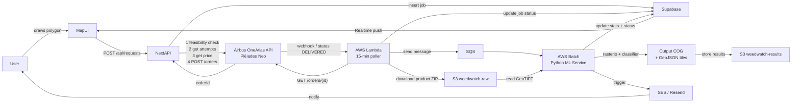
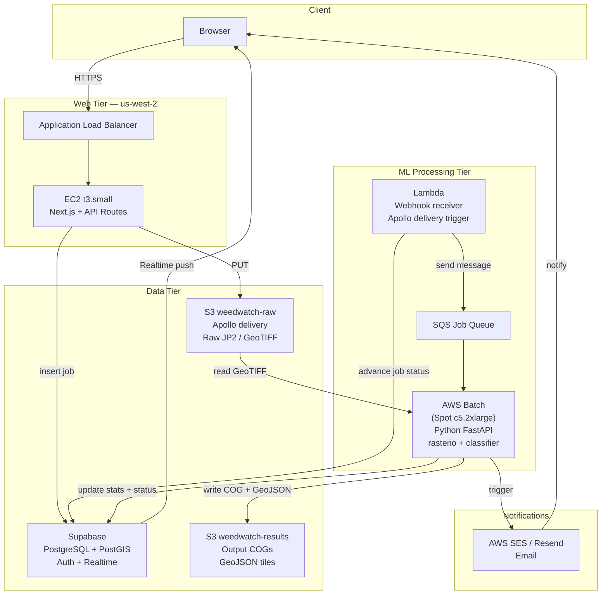

# WeedWatch AI Prototype — Epics & Feature Breakdown

---

## Executive Introduction

### The Problem

Herbicide overuse is one of the most expensive and damaging inefficiencies in modern agriculture. Farmers today apply chemicals on fixed schedules across entire fields — regardless of where weeds actually are, how dense the infestation is, or what the weather will do. In the United States alone, **$6.6 billion is spent annually on herbicide applications** across just four crops (soybean, corn, cotton, sorghum). The cost of pesticides has risen 66% in three years. Most of that spend is waste.

The core problem is information. Farmers lack affordable, timely, field-level intelligence on weed presence and distribution. Existing alternatives are either too expensive, too slow (manual field scouting takes days), or too coarse to guide precision spraying.

### The Solution

WeedWatch AI delivers **precision weed intelligence from orbit**. By combining high-resolution satellite imagery with machine learning models trained on real field data, WeedWatch can tell a farmer:

- **Where** weeds are (spatial distribution at 5×5 m resolution)
- **How bad** the infestation is (density and coverage statistics)
- **When** to spray (optimized timing based on weed growth stage, weather, and GDD)

All of this is delivered in seconds, cheaper than the next best option — and with 80% accuracy.

### The Prototype — What It Is

This prototype is a **full-stack web application** that demonstrates the complete WeedWatch value chain in an operational setting. It is designed to serve two simultaneous purposes:

1. **Scientific validation**: A working tool to request weed maps, validate ML model outputs against field truth, and iterate on the detection pipeline.

2. **Market validation**: A demonstrable product that shows investors, agricultural co-ops, and prospective customers exactly how the service works — from drawing a polygon on a map to receiving an actionable weed report in their inbox.

The prototype is not a mockup or a demo. It executes real satellite tasking via the Airbus OneAtlas API, processes real Pléiades Neo imagery, and produces real classified weed maps.

### Market Value Framed by the Prototype

Each stage of the prototype directly unlocks a layer of market value:

| Stage | What it proves | Market value unlocked |
|---|---|---|
| **Stage 0** | End-to-end pipeline works: polygon → satellite → weed map → notification | Proof-of-concept for seed investors; tool for research team; basis for NSF SBIR reporting |
| **Stage 1** | Paying users can purchase weed maps per acre; agronomic enrichment (NDVI, GDD, weather) adds decision value | Commercial launch; per-acre revenue model validated; data for pricing calibration |
| **Stage 2** | Seasonal prediction + tractor file export makes WeedWatch actionable at the operational level | Enterprise deals with agri-companies and co-ops; integration into existing precision ag stack |

### Unit Economics — Why This Matters at Scale

| | Per acre | 5% of US market (9.8M acres) |
|---|---|---|
| Farmer herbicide saving | $5 | $49M |
| WeedWatch price | $3 | $29.4M revenue |
| WeedWatch cost | $1 | $9.8M |
| **WeedWatch gross profit** | **$2** | **$19.6M** |

At 5% penetration of just the US soybean, corn, cotton, and sorghum market, the profit opportunity is **$20M/year**. Across the US, Brazil, Argentina, and global markets, the total addressable profit at 5% share reaches **$101M/year**.

The prototype is the first step toward that number — and the first thing any serious customer or investor will ask to see.

---

## Proposed Tech Stack

- **Frontend**: Next.js (App Router) — extend existing repo under `/app/(app)/` route group
- **Database + Auth + Storage**: Supabase (PostgreSQL + PostGIS + Auth + Realtime + Storage)
- **Map**: MapLibre GL JS + `@mapbox/mapbox-gl-draw` for polygon drawing
- **Background ML processing**: Python FastAPI microservice (rasterio, numpy, scikit-learn)
- **Job queue**: Supabase `jobs` table + Realtime subscriptions (polling fallback)
- **Email**: Resend
- **Satellite ordering**: Apollo Mapping (manual/email trigger in Stage 0, API in Stage 1 if available)

## Architecture Flow



---

## Stage 0 — Core Prototype

> Goal: end-to-end flow from polygon draw → satellite order → weed map → email notification

### Epic 0.1 — Authentication & User Management

- User registration (email + password)
- Email verification on sign-up
- Login / logout
- Password reset via email link
- Protected route middleware (redirect unauthenticated users)
- User profile page (name, email, org)
- Supabase Auth setup with RLS policies

### Epic 0.2 — Map Interface & Polygon Drawing

- Full-screen map view centered on California (MapLibre GL JS)
- Zoom, pan, basemap (satellite imagery tile layer)
- Polygon drawing tool (draw, edit, delete)
- Area size display in acres as polygon is drawn
- Minimum / maximum polygon area validation (e.g. 1–50,000 acres)
- "Request Weed Map" button — disabled until valid polygon drawn
- Request confirmation modal showing area, estimated cost/timeline

### Epic 0.3 — Satellite Tasking & Job Tracking

> **Note on Apollo Mapping:** Apollo Mapping is a reseller — they have **no public REST API**. Their website explicitly serves clients who "don't want to code or invoke an API." For programmatic satellite tasking, the integration is built directly against the **Airbus OneAtlas API**, which is the underlying provider for Pléiades Neo imagery. Apollo Mapping remains the billing/account relationship (Nima / TUH), but all API calls go to Airbus. Confirm that the TUH account has direct Airbus OneAtlas API credentials.

#### Airbus OneAtlas API — Tasking Workflow

OneAtlas uses OpenID Connect authentication and a 6-step order flow:

```
1. POST /auth/token          → get Bearer token (API key exchange)
2. GET  /api/v1/contracts    → list available "neo" backend contracts
3. POST /feasibility         → check acquisition feasibility for polygon + date range
4. GET  /attempts            → list possible acquisition windows (ONEDAY / ONENOW offers)
5. GET  /price               → calculate cost for selected attempt
6. POST /orders              → create tasking order → returns orderId
7. GET  /orders/{orderId}    → poll status until "DELIVERED"
8. GET  /workspace/products  → list delivered products + download URLs
```

Base URL: `https://order.api.oneatlas.airbus.com`
Auth URL: `https://authenticate.foundation.api.oneatlas.airbus.com/auth/realms/IDP/protocol/openid-connect/token`

Tasking offer types supported:
- **ONEDAY** — next available pass (fastest, ~1–3 days)
- **ONENOW** — priority tasking (same/next orbit)
- **ONEPLAN** — scheduled acquisition window
- **ONESERIES** — recurring acquisitions (Stage 2)

#### Features

- `requests` table: polygon geometry (PostGIS), user ID, OneAtlas `orderId`, status, timestamps
- `POST /api/requests` — creates DB record, calls OneAtlas feasibility → attempts → price → order
- Job status state machine:

```
pending → feasibility_check → ordered → data_processing (Airbus) → delivered → ml_processing → complete → failed
```

- `GET /api/requests/:id/status` — polls OneAtlas `GET /orders/{orderId}` and syncs to DB
- Background poller (AWS Lambda on 15-min schedule) syncs all `ordered` jobs with OneAtlas
- Webhook endpoint `POST /api/webhooks/oneatlas` — receives Airbus delivery notification (if available on contract)
- Request dashboard: list all requests with live status badges and OneAtlas order reference
- Supabase Realtime subscription pushes status changes to the map UI
- Progress stepper UI: `Submitted → Feasibility Check → Ordered → Airbus Processing → ML Processing → Ready`
- On delivery: Lambda downloads product ZIP from OneAtlas workspace URL → uploads raw GeoTIFF to `weedwatch-raw` S3 bucket → triggers ML job via SQS

### Epic 0.4 — Weed Detection ML Pipeline

- Python FastAPI microservice (`/ml-service`)
- Endpoint: `POST /process` — accepts GeoTIFF path, polygon GeoJSON, job ID
- Pixel-based weed classifier (initial: threshold + spectral indices; upgradeable to CNN)
- 5×5m tiling grid generation within the polygon boundary (rasterio)
- Output: classified GeoTIFF + GeoJSON of weed-positive tiles
- Store outputs in Supabase Storage; write stats to `results` table
- Error handling + retry logic; report failure back to job status

### Epic 0.5 — Results Display & Notifications

- Weed map overlay on MapLibre (color-coded tiles: weed / no-weed / confidence level)
- Map legend and opacity slider
- Weed statistics panel:
  - Total area analysed (acres)
  - Weed-affected area (acres + %)
  - Tile-level breakdown
  - Estimated herbicide savings vs. blanket spray
- Download buttons: weed map (GeoTIFF), stats (CSV)
- Email notification via Resend when job reaches `complete` status
  - Summary: area, weed %, map preview image, link to dashboard

---

## Stage 1 — Commercial Layer

> Goal: monetise usage + enrich maps with agronomy data layers

### Epic 1.1 — User Billing (Stripe)

- Stripe integration: per-acre subscription or pay-per-request pricing
- Pricing tiers: Individual farmer vs. Agri-company
- Payment method management (add/remove cards)
- Billing dashboard (invoice history, current usage)
- Usage metering: track acres processed per billing period
- Credit/quota system: user sees remaining acres before submitting request
- Webhook handling for Stripe payment events (success, failure, refund)

### Epic 1.2 — Weather & Climate Data Integration

- Historical and forecast weather data overlay on map (OpenMeteo or Tomorrow.io API)
- Precipitation, temperature, wind layers (toggleable)
- Timeline scrubber to view weather on specific dates

### Epic 1.3 — NDVI Integration

- Compute NDVI from satellite bands and overlay on map
- NDVI time series chart per polygon (field health over time)
- NDVI threshold alerts (low vegetation health notifications)

### Epic 1.4 — Growing Degree Days (GDD) Graph

- GDD calculation from weather data (crop-specific base temperatures)
- GDD accumulation graph per field from planting date
- Weed emergence risk indicators overlaid on GDD timeline
- Crop selection (soybean, corn, cotton, sorghum) to set correct GDD model

---

## Stage 2 — Seasonal Prediction & Tractor Integration

> Goal: forward-looking intelligence + field operations export

### Epic 2.1 — Seasonal Weed Model

- Historical weed map archive per field (stored per request)
- Season-over-season comparison view (side-by-side map or diff layer)
- Weed pressure trend chart (% infestation over time per field)

### Epic 2.2 — Predictive Weed Mapping

- ML model trained on historical maps + GDD + weather to predict future weed pressure
- Predicted weed map output with confidence intervals
- "Spray recommendation" layer: when and where to apply herbicide in the next 2–4 weeks
- Model retraining pipeline as new field data accumulates (data flywheel)

### Epic 2.3 — map2tractor Integration

- Export weed map as ISO XML / ISOBUS Task file (standard precision ag format)
- Export as Shapefile for compatibility with John Deere Operations Center, CNH AFS, AGCO Fuse
- Variable Rate Application (VRA) prescription map generation (spray rate per zone)
- API endpoint for tractor telemetry systems to pull prescription maps directly

---

## Key Open Questions (to resolve before build)

- **Airbus OneAtlas credentials**: Apollo Mapping has no public REST API — tasking is done directly via Airbus OneAtlas. Confirm with Nima / TUH whether the account has OneAtlas API access (API key) and a "neo" backend contract for Pléiades Neo. Without this, Epic 0.3 cannot go live.
- **ML training data**: Is existing field-truth data from UC Davis / Volcani already digitised and available for the classifier?
- **Repo structure**: Single monorepo (Next.js + FastAPI in `/ml-service`) or two separate repos?

---

## AWS Infrastructure

### Apollo Mapping — Data Specs & I/O

Apollo Mapping's primary high-resolution product is **Pléiades Neo** (Airbus), delivered in **DIMAP V2** format.

**Input format per order:**
- Archive: ZIP containing `.JP2` (JPEG 2000) tiles + XML metadata
- Panchromatic: 30 cm resolution, 1 band, 16-bit
- Multispectral: 1.2 m resolution, 6 bands (Deep Blue, Blue, Green, Red, Red Edge, NIR), 16-bit
- Pan-sharpened product: 30 cm, 6 bands (recommended for weed detection)
- Delivery method: SFTP drop or presigned S3 URL (confirm with Apollo)
- Georeferencing: RPC metadata + optional GCPs; requires orthorectification step

**Weed detection bands used:**
- NDVI: `(NIR − Red) / (NIR + Red)`
- NDRE: `(NIR − RedEdge) / (NIR + RedEdge)` — more sensitive to early-stage stress
- GNDVI: `(NIR − Green) / (NIR + Green)`

**Processing pipeline per order (Python / GDAL):**
```
1. Unzip DIMAP delivery
2. gdal_translate: JP2 → GeoTIFF (Cloud-Optimized GeoTIFF / COG preferred)
3. gdalwarp: orthorectify + reproject to EPSG:4326
4. Clip to user polygon (rasterio.mask)
5. Compute spectral indices (numpy)
6. Run pixel classifier
7. Aggregate to 5×5m tiles (rasterio resample or vectorize)
8. Write output COG + GeoJSON tiles to S3
```

**File size estimates (pan-sharpened, 30 cm, 6 bands, 16-bit):**

| Field size | Raw JP2 (compressed) | GeoTIFF (uncompressed) | COG output |
|---|---|---|---|
| 500 acres | ~300 MB | ~2 GB | ~400 MB |
| 2,000 acres | ~1.2 GB | ~8 GB | ~1.6 GB |
| 10,000 acres | ~6 GB | ~40 GB | ~8 GB |

Working RAM needed during processing: ~3–4× uncompressed GeoTIFF size.

---

### AWS Architecture Diagram



---

### EC2 / AWS Service Sizing

#### Web Server (always-on)
- **Instance**: `t3.small` (2 vCPU, 2 GB RAM) — us-west-2
- **Purpose**: Next.js app + API routes, lightweight traffic for prototype
- **Storage**: 20 GB gp3 EBS root volume
- **Upgrade path**: `t3.medium` (4 GB RAM) or ECS Fargate when load increases

#### ML Processing (on-demand via AWS Batch + Spot)
- **Instance**: `c5.2xlarge` (8 vCPU, 16 GB RAM) — Spot
  - Handles fields up to ~2,000 acres (fits in RAM with COG streaming)
- **Instance for large fields (>5,000 acres)**: `r5.2xlarge` (8 vCPU, 64 GB RAM) — Spot
  - Handles full 40 GB uncompressed GeoTIFF in memory
- **Container**: Docker image with GDAL 3.x, rasterio, numpy, scikit-learn, FastAPI
- **Storage**: 200 GB gp3 EBS scratch volume per job (auto-terminate after job)
- **Processing time estimates**:
  - 500 acres: ~4 min on c5.2xlarge
  - 2,000 acres: ~15 min on c5.2xlarge
  - 10,000 acres: ~20 min on r5.2xlarge

#### Database
- **Stage 0**: Supabase Pro (managed, $25/mo) — avoids RDS setup overhead
- **Stage 1+**: Migrate to RDS `db.t3.medium` (2 vCPU, 4 GB, PostGIS enabled) if Supabase limits are hit

#### Storage (S3, us-west-2)
- `weedwatch-raw`: incoming Apollo data — lifecycle policy: delete after 30 days
- `weedwatch-results`: COGs + GeoJSON — retained indefinitely, S3-IA after 90 days
- `weedwatch-exports`: user downloads (CSV, GeoTIFF, VRA files) — S3-IA from day 1

#### Supporting Services
- **SQS**: standard queue for ML job messages
- **Lambda (poller)**: EventBridge rule triggers every 15 min → polls `GET /orders/{id}` on OneAtlas for all `ordered` jobs → on `DELIVERED`, downloads product ZIP, uploads raw GeoTIFF to S3, sends SQS message, updates job status in Supabase
- **Lambda (webhook)**: `POST /api/webhooks/oneatlas` — receives Airbus delivery push notification as fallback to polling
- **CloudWatch**: logs, alarms for job failures and processing time
- **ALB**: load balancer in front of EC2 web tier

---

### Monthly Cost Estimates (us-west-2)

#### Stage 0 — Prototype (low volume: ~20 jobs/month, avg 1,000 acres)

| Service | Config | Est. cost/mo |
|---|---|---|
| EC2 Web | t3.small, on-demand, 24/7 | $15 |
| EC2 ML (AWS Batch) | c5.2xlarge Spot, 20 jobs × 15 min | $3 |
| S3 Raw storage | 20 jobs × 1.2 GB, deleted after 30d | $0.60 |
| S3 Results storage | 20 jobs × 400 MB, retained | $2 |
| S3 data transfer out | ~5 GB user downloads | $0.45 |
| SQS | 20 messages | <$0.01 |
| Lambda | 20 invocations | <$0.01 |
| ALB | 1 ALB, minimal traffic | $18 |
| Supabase Pro | DB + Auth + Realtime | $25 |
| Resend email | Free tier (3,000/mo) | $0 |
| **Total** | | **~$65/mo** |

> ALB can be replaced with EC2 direct + Elastic IP (~$4/mo) to cut costs to ~$50/mo in Stage 0.

#### Stage 1 — Commercial (medium volume: ~200 jobs/month, avg 2,000 acres)

| Service | Config | Est. cost/mo |
|---|---|---|
| EC2 Web | t3.medium, on-demand | $30 |
| EC2 ML (AWS Batch) | c5.2xlarge Spot, 200 jobs × 15 min | $25 |
| S3 Raw storage | 200 jobs × 1.2 GB, 30d lifecycle | $6 |
| S3 Results storage | cumulative ~500 GB | $11.50 |
| S3 data transfer out | ~50 GB | $4.50 |
| RDS db.t3.medium | PostGIS, Multi-AZ off | $50 |
| ALB | moderate traffic | $20 |
| CloudWatch | logs + alarms | $10 |
| SES email | 10,000 emails | $1 |
| **Total** | | **~$160/mo** |

#### Stage 2 — Production (high volume: ~2,000 jobs/month)

| Service | Config | Est. cost/mo |
|---|---|---|
| ECS Fargate | 2× web tasks | $60 |
| EC2 ML (AWS Batch) | mixed c5/r5 Spot | $200 |
| S3 total | ~5 TB mixed tiers | $80 |
| RDS db.r6g.large | PostGIS, Multi-AZ | $180 |
| ALB + CloudFront | CDN for map tiles | $50 |
| CloudWatch + alerts | | $20 |
| SES + misc | | $15 |
| **Total** | | **~$600/mo** |

---

### Infrastructure-as-Code

Recommended tooling: **Terraform** (or AWS CDK for TypeScript teams).

Key resources to define:
- VPC with public/private subnets (web tier public, ML + DB private)
- Security groups: web → SQS/S3 only; ML → S3 read/write only
- IAM roles: least-privilege per service
- S3 bucket policies + lifecycle rules
- AWS Batch compute environment + job queue + job definition
- CloudWatch log groups + metric alarms (job failure rate, processing time P95)
